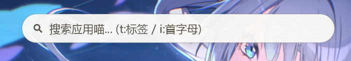

<div align="center">


# Meow App Launcher

**A macOS Spotlight-style launcher that wears a Dynamic Island — for Windows.**

One hotkey away from everything: fuzzy app search (English / 中文 / pinyin), an inline
calculator, web search and system commands. Fully self-drawn with **Rust + Skia** —
no WebView, no HTML, no runtime to install.

[](https://github.com/Alkaid2333/meow-app-launcher)
[](https://github.com/Alkaid2333/meow-app-launcher)
[](https://github.com/Alkaid2333/meow-app-launcher)
[](LICENSE)

**[English](README.md) · [简体中文](README.zh.md)**



<sub>The island summoned with `Ctrl+Alt+Space` — a single superellipse that grows as results arrive.</sub>

</div>

---

## Highlights

### Search

- **Global hotkey** — `Ctrl+Alt+Space` by default, fully rebindable, applied instantly.
- **Fuzzy matching** — English, Chinese and pinyin (full spelling *and* initials), with sub-sequence scoring.
- **Three modes** — plain name search, `t:` for tags, `i:` for initials.
- **IME aware** — composition preview with commit/cancel handled correctly.
- **Unified multi-source pipeline** — apps, calculator, web search and system commands all flow through one
  `SearchItem` / `Action` model, so a new source is a trait implementation away.

### Built-in sources

| | |
|---|---|
| 🧮 **Calculator** | Type an expression (`+ - * / % ^` and parentheses, unary minus included). Shunting-yard evaluator; `Enter` copies the result. |
| 🌐 **Web search** | Any keyword can be sent to Baidu / Bing / Sogou / Google / DuckDuckGo. |
| 🖥️ **System commands** | Lock, sleep, shut down, restart — with a **fully editable alias table**, so `熄屏`, `lock`, `睡眠` all work at once. |

### Look & feel

- **One-piece Dynamic Island** — the search field and the result panel are a single superellipse that morphs as it expands.
- **Spring physics** — six independent transitions (summon / dismiss / expand / collapse, plus expanded variants), each with configurable duration, bounce and mass. Every animation is interruptible and re-solved per frame.
- **Three material presets** — Frosted glass, Mica and Opaque. Text colour and surface are resolved *as a pair*, so contrast is guaranteed in every preset.
- **Row or grid** results, geometric keyboard navigation, hover snapping.
- **Sharp CJK text** on layered windows — rounded glyph sizes, subpixel positioning off, slight hinting.

### Desktop integration

- **System tray** — icon taken from the app's own `.ico` resource, rebuilt automatically when Explorer restarts.
- **Settings GUI** — sidebar plus grouped cards; theme, geometry, hotkey, filters, web search and command aliases are all editable visually.
- **Single instance** — launching it again summons the running one instead of fighting over the screen.
- **Auto-start** on login, **Start Menu scanning** with icon extraction and a PNG snapshot cache, **manual registration** via CLI or drag-and-drop, and **filter rules** to hide noisy entries.

### Rendering & icons

- **Layered window with per-pixel alpha** — Skia draws, `UpdateLayeredWindow` presents. No compositor tricks, no fake transparency.
- **CPU raster by default, GPU/OpenGL optional** — if GPU initialisation fails, it falls back to CPU instead of dying.
- **One icon layer for everything** — SVG (viewBox-aware, mixed stroke/fill), PNG, ICO raster, and glyph fallback all go through the same scale-and-inset path.

> **Status:** Windows 10 / 11 is the only implemented backend today. The animation core and the
> rendering pipeline are deliberately platform-agnostic (see [Architecture](#architecture)), so
> additional backends are a `Platform` trait implementation rather than a rewrite. The UI strings
> are currently Chinese.

---

## Requirements

| | |
|---|---|
| **OS** | Windows 10 / 11 (x64) |
| **Rust** | 1.97+ (edition 2024) — build-time only |
| **Toolchain** | MSVC (`link.exe` + Windows SDK `rc.exe`) |
| **Network** | First build downloads a prebuilt Skia binary (~100 MB) |

No runtime dependencies: the binary is self-contained and portable.

## Installation

Prebuilt installers are published on the [Releases](https://github.com/Alkaid2333/meow-app-launcher/releases)
page (built with Inno Setup — see `template/release-build-template.iss`).

### Build from source

```bash
git clone https://github.com/Alkaid2333/meow-app-launcher.git
cd meow-app-launcher
cargo build --release
# -> target/release/meowal.exe
```

The first build downloads a prebuilt Skia binary. If GitHub Releases is unreachable, point Cargo at a
local copy instead (this also skips the slow source fallback, which needs LLVM):

```bash
SKIA_BINARIES_URL="file://X:/path/to/skia-binaries-<key>.tar.gz" cargo build --release
```

### Development

```bash
cargo run                      # debug build, console attached
MEOWAL_VERBOSE=1 cargo run     # ...with debug-level logging
cargo test                     # 79 tests
```

## Usage

1. Launch `meowal.exe`. On first run it scans the Start Menu (typically 200+ entries) and builds an icon cache.
2. Press `Ctrl+Alt+Space` to summon the island.
3. Type anything — English, Chinese, pinyin, an arithmetic expression, or a keyword.
4. `↑` / `↓` to move, `Enter` to run, `Esc` to hide.
5. Right-click the tray icon to open the settings window.

### Search syntax

| Input | Result |
|---|---|
| `chrome` | Fuzzy app match |
| `计算器` | Match by Chinese name |
| `jsq` | Match by pinyin initials |
| `t: 开发` | Filter by tag |
| `i: p s` | Filter by initials |
| `12 * (3 + 4)` | Calculator → `Enter` copies `84` |
| `rust error E0308` | Web search with the configured engine |
| `锁屏` / `lock` | System command |

### Command line

```bash
meowal register "Notepad" "C:\Windows\notepad.exe"
meowal register "My Tool" "D:\tools\tool.exe" -ico "D:\tools\icon.png"
```

Registration is idempotent and writes to the same data directory the GUI uses. The CLI is a separate
entry point into the same binary, which is why it re-attaches to the parent console (see `src/cli.rs`).

## Architecture

```
src/
├── main.rs            # entry point: logging, data dir, assembly, message loop
├── lib.rs             # library root — the testable core
├── cli.rs             # `meowal register` command line
├── app/
│   ├── mod.rs         # AppState: shared state + command queue
│   └── config.rs      # config structs + JSON persistence
├── window/
│   ├── launcher.rs    # island window: state machine + event dispatch
│   ├── settings.rs    # settings window
│   └── tray.rs        # system tray icon + menu
├── render/
│   ├── mod.rs         # Renderer: Skia surface lifecycle, CPU/GPU backends
│   ├── layout.rs      # pure-function layout math (unit-tested)
│   ├── theme.rs       # theme presets — the only place colour is defined
│   ├── shape.rs       # continuous-curvature (superellipse) geometry
│   ├── font.rs        # font cache
│   ├── text.rs        # text drawing helpers
│   ├── paint.rs       # island scene: search field, panel, rows
│   ├── settings.rs    # settings GUI drawing
│   ├── edit.rs        # generic text editing (text + caret + selection)
│   ├── icon.rs        # unified icon layer (IconSource)
│   └── svg.rs         # lightweight embedded SVG renderer
├── platform/
│   ├── mod.rs         # Platform trait — the ONLY platform boundary
│   └── win32.rs       # Win32 implementation
├── animation/
│   ├── mod.rs         # launcher springs
│   ├── springs.rs     # spring physics (pure math, zero deps)
│   └── island.rs      # island geometry state machine
├── search/
│   ├── mod.rs         # pinyin index + search entry point
│   ├── fuzzy.rs       # sub-sequence matching + scoring
│   ├── item.rs        # SearchItem / Action model
│   ├── provider.rs    # SearchProvider trait + built-in providers
│   └── calc.rs        # calculator (shunting-yard)
├── apps/
│   ├── mod.rs         # app registry, insert/query/persist
│   ├── scanner.rs     # Start Menu .lnk scanning
│   └── icon.rs        # icon extraction -> Skia Image + PNG cache
└── utils/
    ├── mod.rs
    └── logger.rs      # logforth layout, colours, split log files
```

`tests/` holds 79 tests across 16 files, covering springs, fuzzy matching, search, layout, shapes,
the island state machine, the SVG renderer, text editing, the CLI parser, assets and a GPU smoke test.

### Design rules

These aren't aspirations — they're enforced by the module layout:

1. **`animation/` is pure mathematics.** No Skia, no platform calls, no I/O. Fully unit-testable.
2. **`platform/` is the only place `cfg(target_os)` may appear.** Everything above it talks to a trait.
3. **`render/` consumes numbers, it never computes animation.** Springs and layout are solved elsewhere; the renderer just draws the frame it is handed.
4. **Animations are always interruptible.** Each frame is re-solved from the current state rather than played back from a timeline.
5. **The window is a layered, per-pixel-alpha surface.** Skia rasterises, `UpdateLayeredWindow` presents.
6. **Slow work never blocks the message loop.** Scanning and icon extraction go through tokio's blocking pool; the render path only ever reads caches.
7. **Components communicate through a command queue** (`Rc<RefCell<AppState>>` + `VecDeque<Command>`), which is what keeps multi-window coordination from turning into a spiderweb.

## Configuration

Config lives in `./.datas/config.json`, next to the executable (portable — the directory is resolved
from `current_exe()`, so the GUI and the CLI always agree on it). Everything below is also editable
from the settings GUI.

| Key | Default | Notes |
|---|---|---|
| `hotkey.enabled` | `true` | |
| `hotkey.modifiers` | `"ctrl+alt"` | `ctrl` / `alt` / `shift` / `win`, combinable with `+` |
| `hotkey.key` | `"space"` | |
| `window.layout` | `"row"` | `row` / `grid` |
| `window.icon_size` | `36.0` | px |
| `window.show_recent` | `false` | |
| `window.show_favorites` | `false` | |
| `window.show_frequent` | `false` | |
| `window.show_all` | `true` | Show every app on an empty query |
| `theme.preset` | `"frosted_glass"` | `frosted_glass` / `mica` / `opaque` |
| `search.default_mode` | `"name"` | `name` / `tag` / `initial` |
| `search.filters` | `卸载`, `uninstall` | Keyword rules that hide matching entries |
| `search.web_engine` | `"baidu"` | `baidu` / `bing` / `sogou` / `google` / `duckduckgo` |
| `search.web_browser` | `""` | Empty = system default. Supports a quoted path and a `%1` placeholder |
| `search.commands` | 4 entries | Alias table (`aliases` + `kind`) for lock / sleep / shutdown / restart |
| `island.*` | see below | Island geometry and animation |
| `auto_start` | `false` | Writes the Windows `Run` key |
| `render_backend` | `"cpu"` | `cpu` / `gpu` — GPU falls back to CPU on failure |

<details>
<summary><code>island.*</code> defaults</summary>

| Key | Default |
|---|---|
| `width` / `height` | `300` / `46` |
| `x` / `y` | `50` / `14` |
| `expandedWidth` / `expandedHeight` | `560` / `268` |
| `inputRatio` | `0.72` |
| `expandedRadius` | `34` |
| `padX` / `padY` | `18` / `15` |
| `slotHeight` | `34` |
| `summonSquash` | `0.34` |
| `margin` | `16` |
| `animFps` | `0` (follow the display) |
| `motionMode` | `"spring"` — `spring` / `ease` / `linear` / `instant` |
| `easing` | `ease_out_quint` |
| `reduceMotion` | `false` |
| `autoMorph` / `draggable` | `true` / `true` |
| `springs` | per-transition `{ duration, bounce, mass }` |

</details>

### Data directory

```
.datas/
├── config.json     # configuration
├── apps.json       # registered applications
├── icons/          # cached icon PNG snapshots
└── logs/
    ├── info.log    # info and below
    └── error.log   # error and above
```

## Logging

A loguru-style coloured console layout built on `logforth`:

```text
2026-09-10 19:40:12.345 | INFO     | meowal::window::launcher - 呼出搜索框喵~
2026-09-10 19:40:12.678 | DEBUG    | meowal::platform::win32 - 窗口创建成功喵
```

- Console: coloured — level, module and message are each tinted.
- Files: rolled at 512 KB × 3, split into `info.log` and `error.log`.
- Set `MEOWAL_VERBOSE=1` for debug-level output.

## Testing

```bash
cargo test
```

79 tests, no GPU or display required for the core suites (the GPU test degrades to a smoke check).

## Roadmap

Phase 1 and 2 (the feature loop and the full desktop experience) are done; Phase 3a (the search hub)
is nearly closed. See **[ROADMAP.md](ROADMAP.md)** for the full plan, and
**[CHANGELOG.md](CHANGELOG.md)** for what shipped in each version.

## Contributing

Issues and pull requests are welcome. Two things worth knowing before you start:

- `animation/` and `layout.rs` are pure and unit-tested — changes there should come with tests.
- Icon assets in `assets/icons/*.svg` are user-replaceable; if you change the SVG renderer, keep the
  subset it supports in mind (it is intentionally small, not a full SVG implementation).

## Acknowledgements

- The **dark theme** palette (window / sidebar / group / control colors) is adapted from
  **WinIsland**, the other Skia-based dynamic island experiment (D3D backend) — thanks
  to that project for the color system.
  [WinIsland](https://github.com/WinIslandProject/WinIsland "WinIsland Repo here")

## License

[MIT](LICENSE) © 2026 若有人兮233
